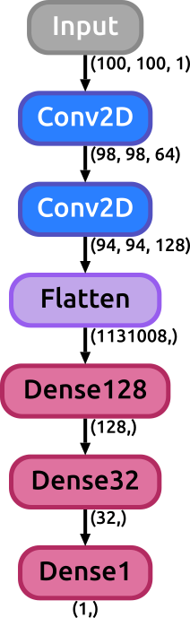
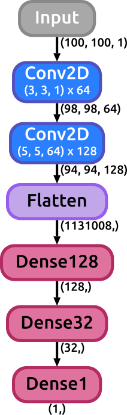

# Keras SVG Model plot library

This library was designed to help in the process of visualizing keras models graphs. It was expected to be as straightforward as possible.

## Prerequisites

* Keras
* Graphviz & Pydot

## HOW TO USE

First define your model using keras. Something like:

```
from keras.layers import Input,Conv2D,Dense,Flatten
from keras.models import Model

input = Input(shape=(100,100,1))
layer = Conv2D(64,(3,3),activation='relu')(input)
layer = Conv2D(128,(5,5),activation='relu')(layer)
layer = Flatten()(layer)
layer = Dense(128,activation='relu')(layer)
layer = Dense(32,activation='relu')(layer)
layer = Dense(1,activation='softmax')(layer)

model = Model(input,layer)
```

Now call the function to visualize the model (it does not require the model to be compiled nor trained, just created)
```
from K_model_plot import _get_model_Svg
_get_model_Svg(model,filename="my_model.svg",display_shapes=True)
```

This call will generate an svg image with a graph representing the model we just created. The "display_shapes" flag is used to toggle between displayinh or not the shape of the data through the layers of the net or not displaying them. In case the flag is set to True, the shape of the activations will be shown after any layer of the model that has the potential to effectively change the size of the data: convolutional, dense, pooling, flatten layers (activation, normalization, concatenate, merge, dropout layers are ignored). There is another flag that can be specified: "display_params", which is by default set to False. When this flag is set to True some important parameters of different layers of the model are displayed along with the layer itself (such as the kernel size and strides of a Conv2D layer, or the pool_size of a Pool layer, the dropout rate in a dropout layer, etc.). 

In the case of the example model previously defined the resulting SVG image would look like:

<p align="center">
 
</p>

If the display_params flag was set to True in the previous example the result would look like:

<p align="center">
 
</p>


## CODE DEMO

A DEMO of this usage and the code can be found in jupyter notebook "Plot_Deep_Nets_DEMO.ipynb".

## Authors

* **Manuel Blanco Valentin** - http://github.com/manuelblancovalentin
* **Clecio R. Bom** - https://github.com/cdebom

 
